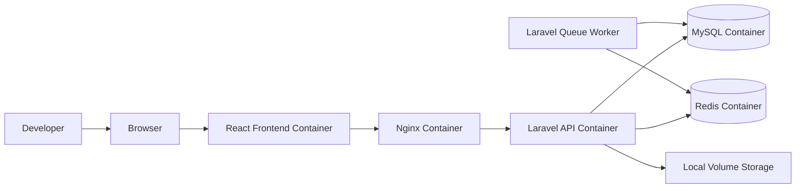
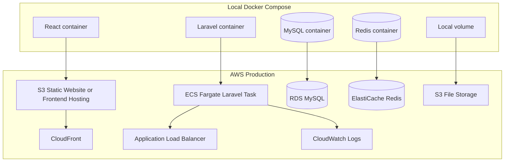
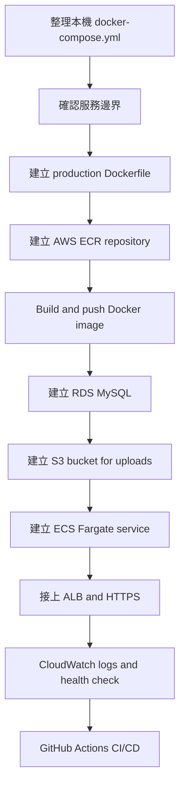
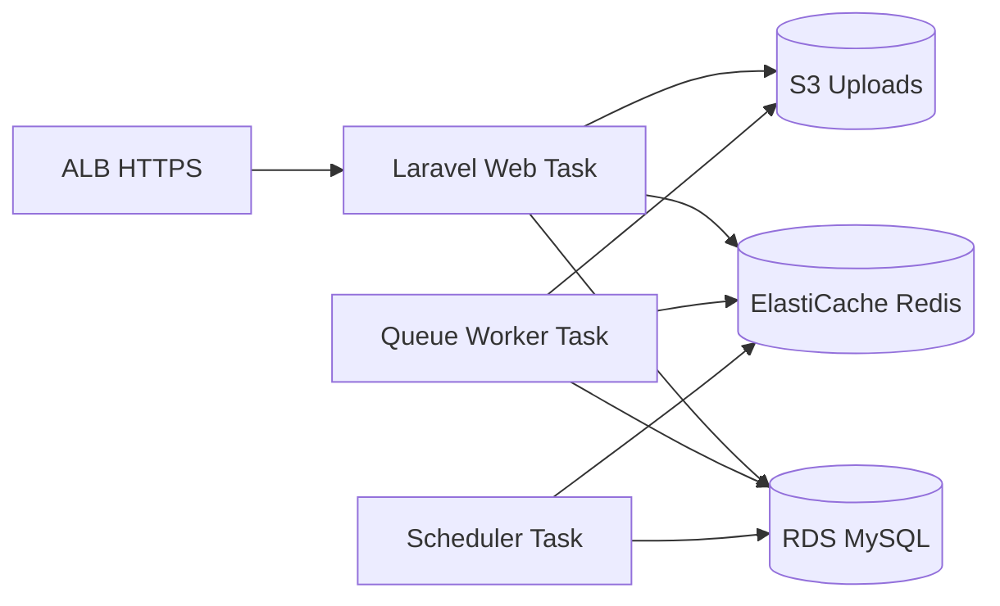
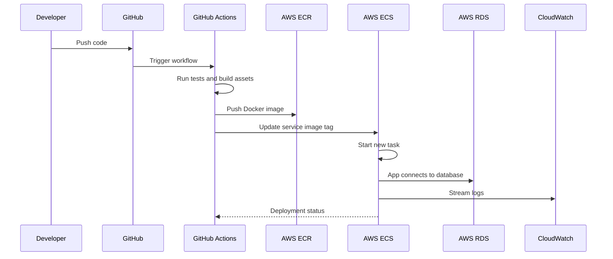
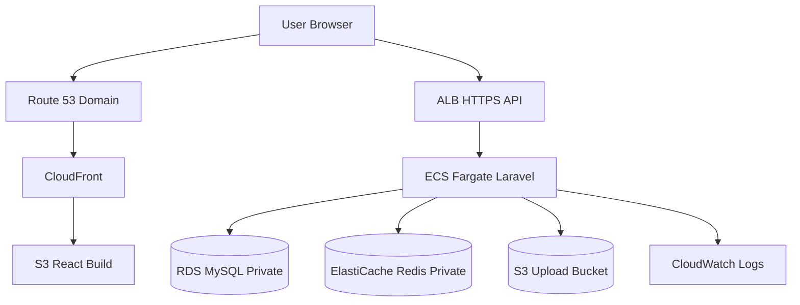

# AWS Docker Compose Deployment Guide

這份筆記用全端工程師熟悉的 Docker Compose 視角，理解如何把 React + Laravel + MySQL + Redis 類型的系統部署到 AWS。

目標不是背 AWS 服務名稱，而是建立一個可遷移的架構心智模型：

```text
本機 docker compose
  -> 容器化服務邊界
  -> 雲端受管理服務
  -> 可重複部署流程
```

## 1. 從 Docker Compose 看系統邊界

本機開發常見架構：



Compose 的價值是讓你先把系統拆成服務：

| Compose 服務 | 責任 |
|---|---|
| React | 前端 build 或 dev server |
| Nginx | Reverse proxy / static files / PHP-FPM gateway |
| Laravel | API / business logic |
| MySQL | relational database |
| Redis | cache / queue backend |
| Queue Worker | async jobs |
| Scheduler | Laravel scheduled commands |
| Volume | local persistent files |

### 常見雷點

- 把 Compose 當成 production 架構直接搬上雲端，容易忽略資料持久化、備份、安全性。
- 把 MySQL、Redis、上傳檔案都放在同一台機器或同一組 volume，正式環境風險很高。
- 本機 `.env` 可以寬鬆，production `.env` 需要嚴格管理 secret、host、port、APP_KEY、queue driver。

## 2. Compose 服務如何對應 AWS

AWS 上通常不是把所有 container 原封不動搬過去，而是把「有狀態」服務改成受管理服務。



| Docker Compose | AWS 對應 | 說明 |
|---|---|---|
| `frontend` | S3 + CloudFront | React build 後多數情境可作為 static assets 部署 |
| `backend` | ECS Fargate | 執行 Laravel container，不需要管理 EC2 主機 |
| `mysql` | RDS MySQL | AWS 管理備份、升級、儲存、可用性 |
| `redis` | ElastiCache Redis | 用於 cache、queue、session |
| `nginx` | ALB 或 container nginx | ALB 負責外部流量，nginx 可視架構保留 |
| `.env` | ECS env / Secrets Manager | secret 不應放入 image 或 Git |
| `volume` | S3 | 上傳檔案不要存 container local disk |
| container logs | CloudWatch Logs | production debug 的主要入口 |
| docker image | ECR | AWS 的 container image registry |

### 常見雷點

- 以為 ECS Fargate 會保留 container 內檔案。實際上 container 應該被視為可銷毀，重要檔案要放 S3。
- 把資料庫開 public access，然後用密碼保護。正式環境應放 private subnet，限制 security group。
- React build 時把 API URL 寫死成 localhost，部署後前端會打不到 API。
- Laravel `APP_URL`、`SANCTUM_STATEFUL_DOMAINS`、CORS 設錯，會造成登入、cookie、CSRF 問題。

## 3. 推薦學習路線



建議順序：

1. 先讓本機 `docker compose up -d` 穩定跑起來。
2. 把 Laravel image 做成 production 可執行版本。
3. 把 MySQL 從 Compose 服務替換成 RDS。
4. 把本機上傳檔案替換成 S3。
5. 把 Laravel container 部署到 ECS Fargate。
6. 用 ALB 對外提供 HTTPS。
7. 用 CloudWatch 看 log。
8. 最後才接 GitHub Actions 做自動部署。

### 常見雷點

- 還沒釐清 production Dockerfile，就急著上 ECS，結果 image 可以 build 但 container 啟動失敗。
- 沒有先處理 migration 策略，導致新版程式上線後資料庫 schema 不一致。
- 沒有設定 health check endpoint，ALB 會以為服務壞掉，反覆重啟 task。
- Queue worker 和 web container 混在一起跑，流量大時很難獨立擴展。

## 4. Laravel 在 AWS 上的拆分方式

Laravel production 不只一個 web service，通常會拆成多種 task。



| Laravel 角色 | Compose command | AWS ECS 對應 |
|---|---|---|
| Web API | nginx + php-fpm 或 artisan serve | ECS Service |
| Queue worker | `php artisan queue:work` | ECS Service 或 long-running task |
| Scheduler | `php artisan schedule:work` | ECS Service 或 EventBridge scheduled task |
| Migration | `php artisan migrate --force` | one-off ECS task / CI step |

### 常見雷點

- `php artisan migrate` 不應在每個 web container 啟動時自動跑，否則多 task 同時啟動可能互相衝突。
- Queue worker 部署新版程式後要重啟，否則 worker 可能還在跑舊 code。
- Scheduler 在多台 task 同時跑時，要避免同一個排程重複執行。
- Laravel cache config 後，`.env` 改了但沒有重新 `config:cache`，production 會讀到舊設定。

## 5. Deployment 流程



基本流程：

1. Engineer push code 到 GitHub。
2. GitHub Actions 執行測試。
3. Build Docker image。
4. Push image 到 ECR。
5. 更新 ECS service。
6. ECS 啟動新 task。
7. ALB health check 通過後切流量。
8. CloudWatch 觀察 log 和錯誤。

### 常見雷點

- image tag 永遠用 `latest`，出事時很難 rollback。建議使用 commit SHA tag。
- CI/CD 沒有先跑測試，只負責部署，會把錯誤快速送進 production。
- ECS task definition 的 env 和 image 版本沒有版本化管理，之後很難追蹤變更。
- 部署成功不代表服務可用，必須看 ALB target health、application log、HTTP status。

## 6. 最小可行 AWS 架構

第一版不要追求一次到位，先建立可理解、可維護的最小 production 架構。



最小清單：

- Route 53：管理 domain DNS。
- ACM：管理 HTTPS certificate。
- S3 + CloudFront：部署 React static frontend。
- ALB：提供 API HTTPS entrypoint。
- ECS Fargate：執行 Laravel container。
- RDS MySQL：正式資料庫。
- ElastiCache Redis：cache / queue。
- S3 upload bucket：檔案上傳。
- CloudWatch Logs：看 production logs。

### 常見雷點

- 沒有區分 frontend domain 和 API domain，例如 `app.example.com` 與 `api.example.com`。
- CORS 只在本機測過，production domain 沒加入允許清單。
- Security Group 設太寬，例如 database 允許 `0.0.0.0/0`。
- S3 bucket 設 public 來解決圖片顯示問題，結果把不該公開的檔案暴露出去。應依照情境使用 private object、signed URL 或 CloudFront。

## 7. 你可以如何用這份筆記練習

第一輪只要能回答這些問題，就代表你已經開始理解 AWS 部署架構：

1. Docker Compose 裡哪些服務是 stateless？
2. 哪些服務是 stateful，應該改成 AWS managed service？
3. Laravel container 需要哪些 env？
4. 上傳檔案為什麼不能放 container local disk？
5. Queue worker 和 web API 為什麼應該分開？
6. ECS task 失敗時要去哪裡看 log？
7. RDS 為什麼不應該 public？
8. React production build 的 API URL 要怎麼設定？

下一步可以建立一個實作 repo，依序加入：

```text
01-local-compose/
02-production-dockerfile/
03-aws-ecr/
04-ecs-fargate/
05-rds-s3-redis/
06-github-actions-cicd/
```

