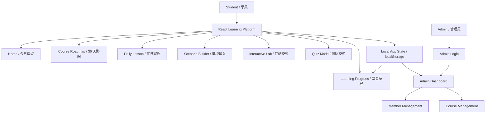
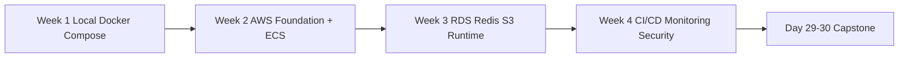
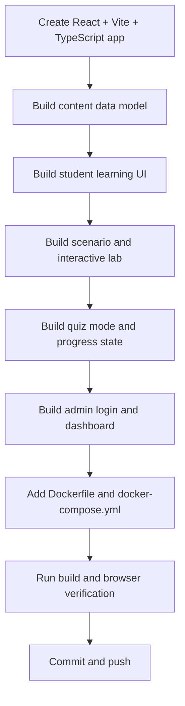

# 30-Day AWS Docker Compose Learning Platform Execution Plan

本文件是 `aws-cloud-deployment-learning` 教學網站的完成執行方案。目標是建立一個能實際學習、互動、測驗、追蹤進度、並具備後台管理的 30 天課程網站，使用 `TicketFactory` 作為真實 Docker Compose 專案案例。

## 1. Product Goal / 產品目標

建立一個面向全端工程師的教學網站：

- 受眾：熟悉 `React`、`Laravel`、`TypeScript`，但對 `AWS Deployment` 初學。
- 主題：30 天把一個 `Docker Compose` 專案落地到 `Amazon Web Services`。
- 案例：`~/SideProject/TicketFactory/`。
- 語言規則：專業名詞保留 English，主要說明採用中文 + English 補充。
- 必備功能：
  - `Teaching Mode / 教學模式`
  - `Scenario Input / 情境輸入`
  - `Interactive Mode / 互動模式`
  - `Quiz Mode / 測驗模式`
  - `Learning Progress / 學習歷程`
  - `Admin Login / 後台帳號密碼登入`
  - `Admin Dashboard / 數據儀表板`
  - `Member Management / 會員管理`

## 2. Evidence From TicketFactory / 案例專案證據

目前已讀取 `~/SideProject/TicketFactory/`，可作為課程案例的重點如下：

| Area | Evidence |
|---|---|
| Runtime | `backend/composer.json` 使用 `Laravel 12`、`Sanctum`、`Horizon`、`Reverb`、`Filament` |
| Frontend | `frontend/client/package.json` 與 `frontend/admin/package.json` 使用 `React 19`、`Vite 7`、`TypeScript`、`MUI`、`Zustand` |
| Local Compose | `docker-compose.yml` 包含 `nginx`、`php`、`postgres`、`redis`、`horizon`、`reverb`、`scheduler`、`client-dev`、`admin-dev`、`pgadmin` |
| Production Compose | `docker-compose.prod.yml` 包含 `nginx`、`php`、`postgres`、`redis`、`horizon`、`reverb` 與 resource limits |
| Teaching Material | `specs/000-docker-env-setup`、`specs/023-production-security-hardening`、`DEPLOYMENT-CHECKLIST.md` 可轉為課程內容 |
| Ports | TicketFactory local compose 使用 `8080:80`、`8443:443`、`5432`、`6379`；Docker Desktop 目前占用 host `80/443` |

### Productionization Labs From TicketFactory

`TicketFactory` 不應被包裝成「已經完美可直接上 production」的範例，而應被設計成很真實的 productionization case study。可轉成進階 lab 的素材：

| Lab | Teaching Point |
|---|---|
| Production image packaging | `docker/php/Dockerfile` 是 runtime image，進 production 時要補 `COPY backend source`、`composer install --no-dev`、cache optimize |
| Frontend artifact delivery | `docker-compose.prod.yml` 宣告 `client_dist` / `admin_dist` volumes，但還需要 builder pipeline 產生 React dist |
| Scheduler production runtime | Dev compose 有 `scheduler`，production compose 需要補 ECS scheduled task 或獨立 scheduler service |
| Queue worker separation | `horizon` 適合教 ECS service、graceful shutdown、retry、queue scaling |
| WebSocket deployment | `reverb` + Nginx `ws` proxy 可延伸到 ALB WebSocket routing |
| Reliability under concurrency | `e2e/load/concurrent-seat-selection.js` 可教 Redis lock、DB transaction、queue 與 high-concurrency ticket booking |

### Port Strategy / Port 避免衝突策略

教學網站本身避免使用：

- `80`
- `443`
- `3000`
- `5173`
- `5174`
- `8080`
- `8443`
- `5432`
- `6379`

建議使用：

- Web app dev port：`4321`
- Preview port：`4322`
- Docker exposed port：`4321:4321`

TicketFactory 若要在教學過程中啟動，應另建 override：

```yaml
services:
  nginx:
    ports:
      - "18080:80"
      - "18443:443"
  postgres:
    ports:
      - "15432:5432"
  redis:
    ports:
      - "16379:6379"
```

## 3. Proposed Architecture / 網站架構

第一版使用前端單頁應用加上本地狀態模擬完整產品體驗，快速完成可學習、可測驗、可展示的版本。



### First Build Scope / 第一版範圍

第一版先做完整可用體驗，不急著接真實資料庫：

- `React + TypeScript + Vite`
- `localStorage` 保存學習進度、測驗紀錄、登入狀態
- Docker Compose 包裝網站
- Admin demo account：
  - Email：`admin@example.com`
  - Password：`password123`

之後第二階段可升級為：

- Laravel API
- PostgreSQL
- Session/Auth
- Admin CRUD
- 真實會員與學習歷程資料表

## 4. Page Structure / 頁面結構

### Student Frontend / 學習端

| Page | Purpose |
|---|---|
| `Home` | 直接進入今日課程、顯示目前進度、測驗入口 |
| `Course Roadmap` | Day 1-30 timeline，顯示完成狀態與階段 |
| `Daily Lesson` | 概念、實作、指令、架構圖、檢查點 |
| `Scenario Builder` | 輸入專案條件，產生部署建議 |
| `Interactive Lab` | Docker/AWS 情境除錯、設定檢查、提示 |
| `Quiz Mode` | 每日測驗、階段測驗、錯題解析 |
| `Learning Progress` | 完成天數、技能雷達、測驗紀錄、錯題 |
| `Glossary` | AWS / Docker / Laravel deployment 專業名詞表 |

### Admin Backend / 後台

| Page | Purpose |
|---|---|
| `Admin Login` | 帳號密碼登入 |
| `Admin Dashboard` | 學員數、完課率、測驗通過率、卡關課程 |
| `Member Management` | 搜尋、篩選、查看會員學習歷程 |
| `Course Management` | 30 天課程內容與發布狀態 |

## 5. 30-Day Curriculum / 30 天課程架構



### Week 1: Local Production-Like Docker Stack

| Day | Topic |
|---|---|
| 1 | Course Roadmap / 從本機到 AWS 的部署全貌 |
| 2 | TicketFactory Project Audit / 專案盤點 |
| 3 | Docker Compose Service / Network / Volume |
| 4 | Laravel Container Best Practice |
| 5 | React Build and Runtime Environment |
| 6 | Local Production Simulation |
| 7 | Week 1 Review and Quiz |

### Week 2: First AWS Deployment

| Day | Topic |
|---|---|
| 8 | AWS Account and IAM |
| 9 | VPC / Subnet / Security Group |
| 10 | ECR Container Registry |
| 11 | ECS vs EC2 vs Elastic Beanstalk |
| 12 | ECS Fargate First Deploy |
| 13 | ALB and Health Check |
| 14 | Week 2 Review and First Cloud Endpoint |

### Week 3: Production Data and Runtime

| Day | Topic |
|---|---|
| 15 | RDS MySQL / PostgreSQL |
| 16 | Laravel Migration and Seeding |
| 17 | Secrets Manager / SSM Parameter Store |
| 18 | ElastiCache Redis and Queue Worker |
| 19 | S3 File Storage |
| 20 | CloudFront and React Static Frontend |
| 21 | Week 3 Review and Working Staging System |

### Week 4: Production Readiness

| Day | Topic |
|---|---|
| 22 | Route 53 and ACM HTTPS |
| 23 | CloudWatch Logs and Metrics |
| 24 | GitHub Actions CI/CD |
| 25 | Zero Downtime Deployment |
| 26 | Auto Scaling and Performance |
| 27 | Security Hardening |
| 28 | Cost Optimization |

### Capstone

| Day | Topic |
|---|---|
| 29 | Advanced Architecture Review and IaC Overview |
| 30 | Final Deployment Report and Portfolio Demo |

## 6. Interactive Learning Features / 互動學習功能

### Scenario Builder

輸入項目：

- Project Type：`Laravel + React`
- Database：`PostgreSQL`
- Cache / Queue：`Redis`
- Web Server：`Nginx`
- Runtime：`Docker Compose`
- Target AWS：`EC2`、`ECS Fargate`、`RDS`、`S3`、`CloudWatch`
- Budget：`Low`、`Balanced`、`Production`

輸出：

- 建議 deployment path
- AWS services mapping
- 風險提醒
- 下一個推薦 lesson

### Interactive Lab

第一版 lab：

1. `Port Conflict Debugging`
2. `.env Missing Variables`
3. `ALB Health Check Failed`
4. `RDS Connection Refused`
5. `Queue Worker Not Running`
6. `React API URL Misconfigured`

每個 lab 提供：

- Scenario / 情境
- Config snippet / 設定片段
- User answer / 使用者判斷
- Hint → Diagnosis → Solution 三段式提示

### Quiz Mode

題型：

- `Multiple Choice`
- `Command Order`
- `Config Debugging`
- `Architecture Choice`
- `Security Review`
- `Cost Awareness`

測驗結果必須：

- 顯示分數
- 顯示解析
- 導回相關 lesson
- 寫入 learning progress

## 7. Admin Features / 後台功能

### Login

第一版用本地 demo auth：

```text
email: admin@example.com
password: password123
```

登入成功後保存 session 到 `localStorage`。

### Dashboard Metrics

- `Total Students / 總學員數`
- `Active Learners / 活躍學員`
- `Completion Rate / 完課率`
- `Quiz Pass Rate / 測驗通過率`
- `Average Progress Day / 平均進度天數`
- `Most Blocked Lesson / 最常卡關課程`

### Member Management

- 搜尋會員
- 狀態篩選：`Active`、`Trial`、`Paused`
- 顯示目前 Day、完成率、最近登入、平均分數
- 開啟會員學習摘要 drawer / panel

## 8. Engineering Plan / 工程落地步驟



### Phase 1: Foundation

- Create `package.json`、`vite.config.ts`、`tsconfig.json`
- Create `src/data/course.ts`
- Create `src/data/quizzes.ts`
- Create `src/data/scenarios.ts`
- Create `src/state/progressStore.ts`
- Create `src/state/adminAuth.ts`

### Phase 2: Student App

- `AppShell`
- `HomePage`
- `RoadmapPage`
- `LessonPage`
- `ProgressPage`
- `ScenarioBuilderPage`
- `InteractiveLabPage`
- `QuizPage`
- `GlossaryPage`

### Phase 3: Admin App

- `AdminLoginPage`
- `AdminDashboardPage`
- `MemberManagementPage`
- `CourseManagementPage`

### Phase 4: Docker

- `Dockerfile`
- `docker-compose.yml`
- Expose `4321`
- Add commands:

```bash
docker compose up --build
npm run dev -- --host 0.0.0.0 --port 4321
npm run build
```

### Phase 5: Verification

- Build passes：`npm run build`
- Local app loads：`http://localhost:4321`
- Learning flow works：
  - open lesson
  - mark lesson complete
  - view progress
- Quiz flow works：
  - answer quiz
  - see result
  - progress updated
- Admin flow works：
  - login with demo account
  - dashboard visible
  - member management visible

## 9. Common Pitfalls To Teach / 課程內必須提醒的雷點

| Pitfall | Teaching Note |
|---|---|
| `.env` baked into image | Secret 不應寫進 Docker image，應用 runtime env 或 Secrets Manager |
| Container local storage | Container 可重建，upload files 要放 S3 或 persistent volume |
| Health check wrong path | ALB health check 失敗會造成 ECS task 不斷重啟 |
| Public RDS | Database 應放 private subnet，透過 Security Group 限制來源 |
| Queue worker missing | Laravel web container 不等於 queue worker，需獨立 service/task |
| Scheduler duplicated | 多個 scheduler 會讓排程重複執行 |
| React env confusion | Vite env 是 build-time，production API URL 需要明確策略 |
| Cost surprise | NAT Gateway、CloudWatch retention、RDS instance 都可能造成成本超預期 |
| Port conflict | 本機啟動多個專案前先檢查 `lsof -nP -iTCP -sTCP:LISTEN` |
| Migration during deploy | Rolling update 搭配 destructive migration 可能造成短暫故障 |

## 10. Completion Definition / 完成定義

此目標完成前必須驗證：

- 網站可從 browser 正常載入。
- 首頁不是 landing page，而是直接可學習。
- 看得到 30 天課程架構。
- 可以進入任一 day lesson。
- 可以完成 lesson checkpoint 並更新學習歷程。
- 可以開啟測驗模式、作答、看到分數與解析。
- 可以使用情境輸入產生部署建議。
- 可以進入互動模式查看 debug scenario。
- 可以用帳號密碼登入後台。
- 後台可看到 dashboard metrics。
- 後台可看到會員管理資料。
- Docker Compose 可啟動教學網站，且 port 不與 TicketFactory 常用 port 衝突。
- 已 commit / push 到 `Cerry0524/aws-cloud-deployment-learning`。
